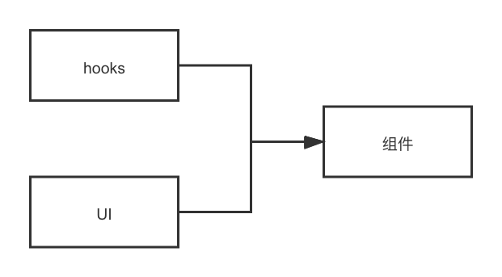

# 介绍

marketing-ui 致力于给程序员提供快速开发互动/营销等页面的能力

> 组件库依赖于Vue3的能力，但是部分组件是纯 canvas 渲染，也就是说你也可以在react 等其他框架下使用某些组件。

## 使用

```bash
yarn add marketing-ui
```

完整引入

```ts
import { createApp } from 'vue'
import MKUI from 'marketing-ui'
const app = createApp()

app.use(MKUI)
```

按需引入

```tsx
import { defineComponent, onMounted, reactive, toRefs } from 'vue'
import { Wheel, sueRotate } from 'marketing-ui'

export default defineComponent({
  setup() {
    const state = reactive({
      angle: 0
    })

    const hooks = useRotate((angle: number) => {
      state.angle = angle
    })

    onMounted(() => {
      hooks.idled()
    })

    return {
      ...toRefs(state)
    }
  },

  render() {
    return <Wheel angle={this.angle} />
  }
})
```

## 理念

互动组件库的开发理念和其他组件库存在差异，归根结底是因为互动组件本身存在非常多的效果/状态等，为了解耦UI和效果，我们设计如下：



每一个互动组件都由 hooks 和 ui 两部分构成，ui 负责DOM结构，hooks 负责效果驱动（hooks 不依赖于 vue3 的能力）。当然，某些组件因为是 canvas 渲染，ui 只是一个 canvas 节点，hooks 不仅负责效果，还负责内容渲染。

> 这也是为什么某些组件可以不依赖 vue3，在其他框架下运行的原因。甚至你可以使用其他框架渲染 ui，搭配组件库的 hooks，一样可以使用。

## 未来

最初的想法是发布三个仓库，分别支持 vue2、vue3 及 react，但是经过这段时间的编码和思考，可能后面会完全用 canvas 来渲染，这样就可以支持任意环境下使用了。
